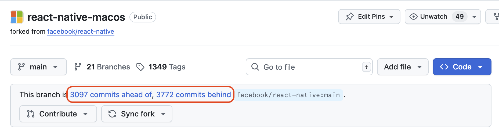

# Sync to a new upstream React Native patch release

Let's assume that React Native macOS is currently at `0.76`, and React Native `0.77` just releasd. We now need to merge all the commits up to `0.77`, and cut a new release branch.

Roughly, the steps look like so:

1. Find the commit that upstreams' `0.77-stable` branched off from `main`. You can use [git merge-base](https://git-scm.com/docs/git-merge-base) to do this, or manually inspect the commit history in the React Native repo.
2. Merge that commit, which will result in a lot of merge conflicts. Resolving these merge conflicts is the bulk of the work. There's a couple of ways to go about this:
    1. Resolve all merge conflicts in place there and listing that in your PR notes
    2. Resolve enough conflictsto make a commit with git diff markers and do the rest as followup to make it easier for reviewers.
3. When your PR is approved and ready to be merged, make sure to choose the option "Create a merge commit", as this preserves commit history and ensures git (and Github) accurately list hwo many commits ahead or behind of React Native we are: 
    - 

Some gotchas:

1. We ** do not ** want to just merge `upstream/0.77-stable` into our `main` branch, as the release branches contain commits that do not belong on `main` (bumping version numbers, local fixes, etc). This is why we look for the merge base
2. It is common while doing the merge to take some particularly hairy commits (ex: a new iOS prop or feature that needs to be ported to macOS) and cherry-pick them into a separate PR so that the merge is easier or more reviewable. 
3. After you create your PR for review, you will need to rebase it often as either:
    - `main` moves forward because other PRs merge (such as the commits you cherry-picked into separate PRs)
    - You create commits to address feedback, and want to fold those back into the big merge commit, or separate discrete and well named commits
3. It is necessary to rebase and not just merge the main branch as you normally would because we merge the whole PR as a merge commit, therefore all of your commits will be added to the git history. it would be better to have commits named `feat: port X feature to macOS` rather than `port stuff` / `pr feedback` / `undo`. Therefore, before you merge the PR, it's good to do one final rebase to clean up your branches git history. 
4. when you run `git merge <commit_hash>` and have all the merge conflicts locally, that’s a good spot to just copy/paste the output of the merge conflicts section of “git status” into your PR notes.
5. GitHub chokes on these big PRs, but the [Github Pull Requests VS Code extension](https://marketplace.visualstudio.com/items?itemName=GitHub.vscode-pull-request-github) does not.

